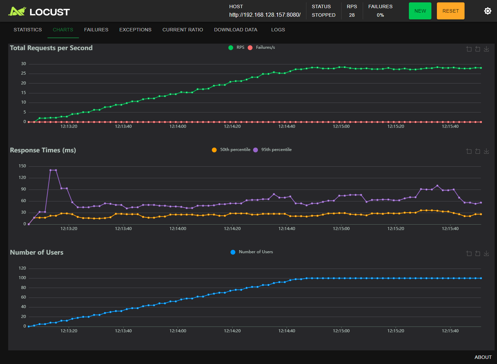
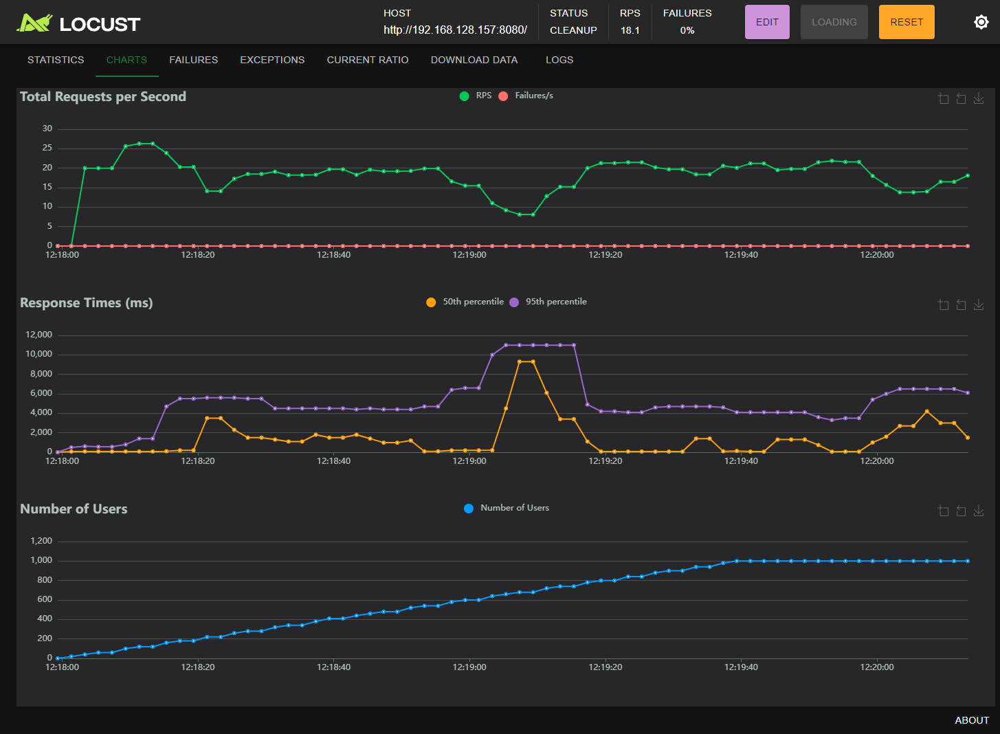

# Flask Web Server Load Testing with Locust

This repository contains a setup for performing load testing on a Python Flask web server using [Locust](https://locust.io/). Locust is an open-source performance/load testing tool that allows you to define your tests using Python code.

## Introduction

Locust is a modern, developer-friendly load testing tool that lets you simulate multiple users to test the performance and scalability of your web applications. With Locust, you can write your test scenarios in regular Python code, making it easy to customize and extend.

## Features

- Simulate thousands of users to test your web server's performance.
- Define load test scenarios using Python code.
- View test results in real-time through a web interface.

## Prerequisites

Before running the load tests, ensure you have the following installed:

- Python 3.x
- Pip (Python package manager)

## Installation

1. **Clone the Repository**

   ```bash
   git clone https://github.com/yourusername/flask-locust-load-testing.git
   cd flask-locust-load-testing
   ```

2. **Install Required Packages**

Install Locust and other dependencies using pip:

```bash
pip install -r requirements.txt
```

Ensure that requirements.txt includes locust and any other dependencies your Flask app needs.

3. **Usage**

Start the Flask Web Server

Ensure your Flask server is running on the desired port. You can start it using:

```bash
python app.py
```

4. **Run Locust Load Tests**

Execute Locust to start load testing:

```bash
locust -f mock_user.py
```

5. **Access the Locust Web Interface**

- Open a web browser and navigate` to http://localhost:8089 to configure and start the load test.

- Configure and Run the Test

- Set the number of total users and the spawn rate.
- Start the test and monitor the results in real-time.
- Load Testing Results

## Test Results

### 100 Users Load Test Result



### 1000 Users Load Test Result



## Conclusion

This repository demonstrates how to use Locust for load testing a Python Flask web server. By running tests with varying user loads, you can gauge the performance and scalability of your application under stress.

For more information on Locust and its capabilities, visit the Locust Documentation.

## License
This project is licensed under the MIT License. See the LICENSE file for details.
